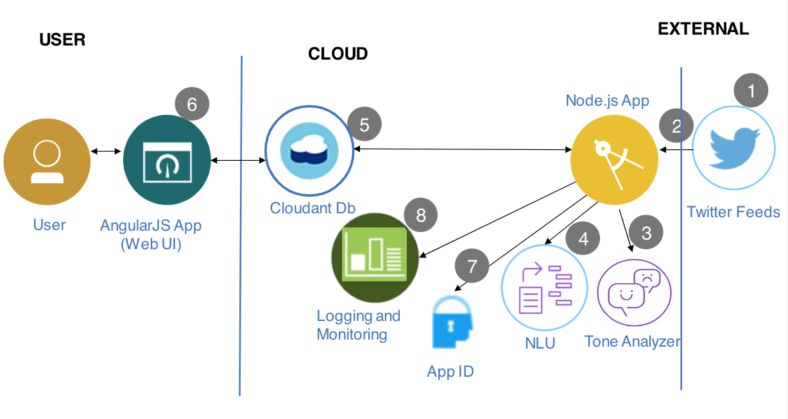
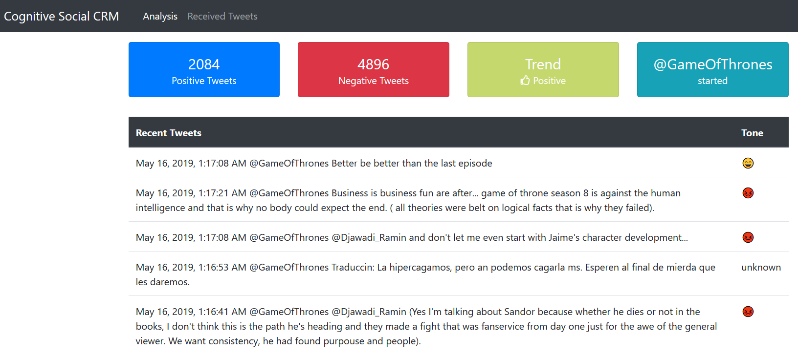
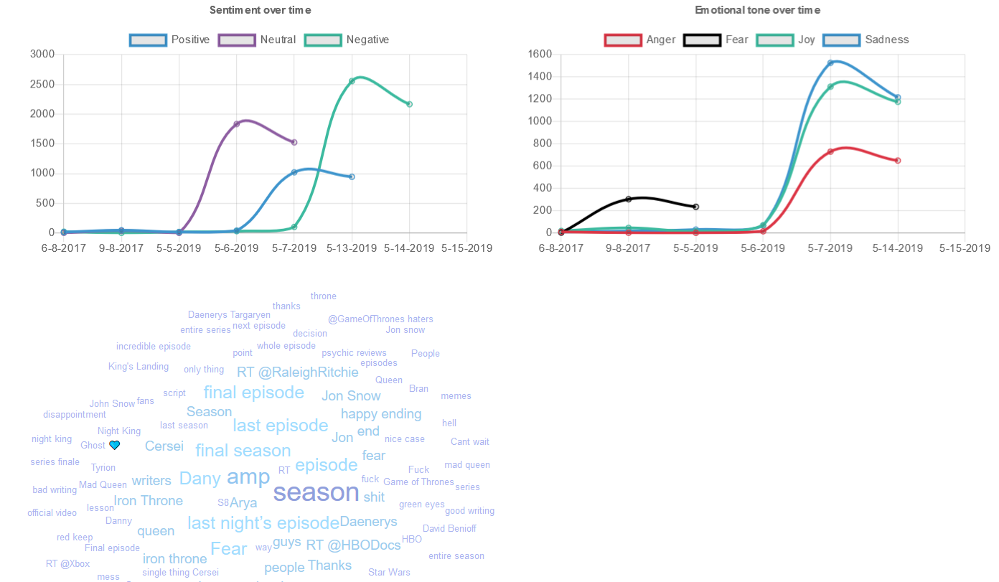

_Read this in other languages: [日本語](README-ja.md)._

[](https://travis-ci.org/IBM/cognitive-social-crm)

# Monitor Twitter feeds to better understand customer sentiment using Tone Analyzer, and Natural Language Understanding

In this code pattern, our server application subscribes to a Twitter feed as configured by the user. Each tweet received will be analyzed for emotional tone and sentiment. All data is stored in a Cloudant database, with the opportunity to store historical data as well. The resulting analysis is presented in a Web UI as a series of graphs and charts.

When the reader has completed this code pattern, they will understand how to:

- Run an application that monitors a Twitter feed.
- Secure the application using App ID to secure the data.
- Send the tweets to Watson Tone Analyzer and Natural Language Understanding for processing and analysis.
- Store the information in a Cloudant database.
- Present the information in a Angular and nodejs web UI.
- Capture and analyze social media for a specified Twitter handle or hashtag and let Watson analyze the content.

## Flow



1. User logs in using his Google account.
2. Tweets are pushed out by Twitter using stream Twitter API.
3. The Cognitive Social CRM app processes the tweet.
4. The Watson Tone Analyzer Service performs analysis of sentiment and emotional tone.
5. The Watson Natural Language Understanding Service pulls out keywords and entities.
6. Tweets and metadata are stored in Cloudant
7. The Web UI displays charts and graphs as well as the tweets.

## Included components

- [App ID](https://www.ibm.com/cloud/app-id): Easily add authentication, secure back ends and APIs, and manage user-specific data for your mobile and web apps.
- [Watson Tone Analyzer](https://www.ibm.com/watson/services/tone-analyzer): Uses linguistic analysis to detect communication tones in written text.
- [Watson Natural Language Understanding](https://www.ibm.com/watson/services/natural-language-understanding): Natural language processing for advanced text analysis.
- [IBM Cloudant](https://www.ibm.com/cloud/cloudant): A managed NoSQL database service that moves application data closer to all the places it needs to be — for uninterrupted data access, offline or on.
- [Cloud Foundry](https://www.cloudfoundry.org/): Build, deploy, and run applications on an open source cloud platform.

## Featured technologies

- [Artificial Intelligence](https://medium.com/ibm-data-science-experience): Artificial intelligence can be applied to disparate solution spaces to deliver disruptive technologies.
- [Databases](https://en.wikipedia.org/wiki/IBM_Information_Management_System#.22Full_Function.22_databases): Repository for storing and managing collections of data.
- [Angular](https://angular.io/): A framework to build UI for mobile and desktop application.
- [Node.js](https://nodejs.org/): An open-source JavaScript run-time environment for executing server-side JavaScript code.
- [Express](https://expressjs.com/): Fast, unopinionated, minimalist web framework for Node.js.
- [Passport](http://www.passportjs.org/): Simple, unobtrusive authentication for Node.js.

# Steps

The setup is done in 3 primary steps. You will download the code, setup the application and then deploy the code to IBM Cloud using IBM Cloud Toolchains. If you would like to run the code locally, there will be one more step to configure the credentials locally.

1. [Clone the repo](#1-clone-the-repo)
2. [Install Dependencies](#2-install-dependencies)
3. [Twitter Requirements](#3-twitter-requirements)
4. [Create IBM Cloud services](#4-create-ibm-cloud-services)
5. [Google Authentication Requirements](#5-google-authentication-requirements)
6. [Configure credentials](#6-configure-credentials)
7. [Run the application](#7-run-the-application)

### 1. Clone the repo

Clone the `cognitive-social-CRM` locally. In a terminal, run:

```
$ git clone https://github.com/IBM/cognitive-social-crm
$ cd cognitive-social-crm
```

### 2. Install dependencies

The application requires the following software to be installed locally.

1. [Node (6.9+)](https://nodejs.org): Application runtime environment, download and install the package.
2. [Angular CLI (6.1.1)](https://www.npmjs.com/package/@angular/cli): A CLI for Angular applications, installed with: `npm install -g @angular/cli`.
3. [Angular (6.1.0)](https://angular.io): Angular will be added as a dependency of client in `package.json` when setting up client using `Angular cli`.
4. [Express (4.16.3)](https://expressjs.com): Express will be added as a dependency in `package.json` for server.

> If you have Angular CLI already installed. Please read the upgrade instructions for Angular CLI when you upgrade the software.

Using Git Bash, run the following command, from the application folder, to install both the client and server dependencies.

```
$ npm run install
```

### 3. Twitter requirements

To subscribe to Tweets from a specific handle or hashtag in this application, it is required to create a Twitter account and a Twitter application.
The Twitter account will be used as the account that receives the messages from other Twitter users as well as the owner of the application, required by Twitter, to receive Tweets.

- You can create a normal Twitter account on [Twitter](https://twitter.com/signup) or use an existing account. It is required to provide a unique email id that isn't already associated with an existing Twitter account as well as a phone number to verify the account.
- Once you have the Twitter account created and verified, log in to [Twitter Dev](https://developer.twitter.com/apps) and create an application.
- Select the Keys and Access Tokens tab and generate a Consumer Key and Secret.
  Keep this page open as you will need to use these tokens into setup procedure in the application later on.

> NOTE: In case you did not configure your application with Twitter APIs, there are sample tweets that the application will use if no twitter API is configured so you can test your application.

### 4. Create IBM Cloud services

You will create in this section: App ID, Watson Tone Aanalyzer, Watson Natural Language Understanding and IBM Cloudant services on IBM Cloud.

1. Login to [IBM Cloud](https://cloud.ibm.com/)
2. Create IBM Cloud services:

#### App ID:

1. To create App ID instance on IBM Cloud, follow the steps in `Cloud Application Development Course Exercise 4 Part 1`.
2. After the App ID instance is created, Navigate to `Manage Authentication` Tab, disable `Facebook` and `Cloud Directory`.
   > This is because you will be using Google only as an Identity provider.
3. Create service alias for App ID:

   - a. Login to IBM Cloud by running the following command:

     ```
     $ ibmcloud login
     ```

   - b. Select the region, where you have created the App ID instance.
   - c. Target a Cloud Foundry organization and space to select the Cloud Foundry API endpoint, organization, and space by running the following command:

     ```
     $ ibmcloud target --cf-api <CF API ENDPOINT> -o <ORG> -s <SPACE>
     ```

     where <CF API ENDPOINT> is the Endpoint you will connect to , you can find the whole list here: [https://cloud.ibm.com/docs/cli/reference/ibmcloud?topic=cloud-cli-cf#cf_login], ORG is by default set to your email, SPACE is by default set to `dev`.

   - 4. Open the [manifest.yml](manifest.yml) file from the code, copy the App Id alias name; which is: "App ID -s1-alias"
        Run the following command:

        ```
        $ ibmcloud resource service-alias-create "appIDInstanceName-alias" --instance-name "appIDInstanceName" -s {{space}}
        ```

        Replace `appIDInstanceName-alias` with the alias name from manifest.yml, and `appIDInstanceName` with the name of the App ID instance you have created on IBM Cloud, and `space` with the space you logged in.

#### Watson Tone Analyzer

- Create Watson Tone Analyzer: [**Watson Tone Analyzer**](https://cloud.ibm.com/catalog/services/tone-analyzer)

#### Watson Natural Language Understanding

- Create Watson Natural Language Understanding: [**Watson Natural Language Understanding**](https://cloud.ibm.com/catalog/services/natural-language-understanding)

#### IBM Cloudant

- Create IBM Cloudant: [**IBM Cloudant**](https://cloud.ibm.com/catalog/services/cloudant)

> NOTE: When provisioning Cloudant, for `Available authentication methods` choose `Use both legacy credentials and IAM`


### 5. Google Authentication Requirements

To use Google Autheantication for users to login. You will need to configure your App ID instance to use Google as its identity provider.

> NOTE: It is required to have a valid gmail to be able to configure the App ID to use google for authentication. - You can create a gmail account on [Gmail](https://www.gmail.com).

- Go to the [App ID Documentation](https://cloud.ibm.com/docs/services/appid?topic=appid-social#google) and follow the steps to configure App ID to use Google as identity provider.

### 6. Configure credentials

The `env.sample` file in the `server` folder should be copied to `.env` before the application is executed on IBM Cloud or locally. The `.env` file chould also reside on the `server` folder as it is required by the server code.

> The `.env` file is where all the parameters like credentials, log settings and other constants required by this application is kept.

#### Configure service credentials

The credentials for IBM Cloud services (App ID, Tone Analyzer, Natural Language Understanding, and Cloudant), can be found in the `Services` menu in IBM Cloud, by selecting the `Service Credentials` option for each service.

> NOTE: When provisioning Cloudant, for `Available authentication methods` choose `Use both legacy credentials and IAM`


From the root of the project, go to `server` folder (`cd server`) and

Copy the [`env.sample`](server/env.sample) to `.env`.

```
$ cd server
$ cp env.sample .env
```

Add all the credentials that you have saved from creating the services, as explained earlier, in the `.env` file.

#### `env.sample`

```
# Copy this file to .env and replace the credentials with
# your own before starting the app.

CLOUDANT_USERNAME=<use cloudant username>
CLOUDANT_PASSWORD=<use cloudant password>
CLOUDANT_ANALYSIS_DB_NAME=analysis_db

## Un-comment and use either username+password or IAM apikey.
# NATURAL_LANGUAGE_UNDERSTANDING_USERNAME=<use natural language understanding username>
# NATURAL_LANGUAGE_UNDERSTANDING_PASSWORD=<use natural language understanding password>
NATURAL_LANGUAGE_UNDERSTANDING_IAM_APIKEY=<use natural language understanding iam API key>
NATURAL_LANGUAGE_UNDERSTANDING_URL=<use natural language understanding URL>

## Un-comment and use either username+password or IAM apikey.
# TONE_ANALYZER_USERNAME=<use tone analyzer username>
# TONE_ANALYZER_PASSWORD=<use tone analyzer password>
TONE_ANALYZER_IAM_APIKEY=<use tone analyzer iam API key>
TONE_ANALYZER_URL=<use tone analyzer url>

# Configuration from you twitter account
TWITTER_CONSUMER_KEY=<use twitter consumer key>
TWITTER_CONSUMER_SECRET=<use twitter consumer secret>
TWITTER_ACCESS_TOKEN=<use twitter access token>
TWITTER_ACCESS_SECRET=<use twitter access secret>
TWITTER_LISTEN_TO=<use your @tag>
TWITTER_FILTER_CONTAINING=<use keyword you want to filter in tweets>
TWITTER_PROCESS_RETWEETS=true

# App ID credentials
APP_ID_CLIENT_ID=<use app id client id>
APP_ID_OAUTH_SERVER_URL=<use app id server url>
APP_ID_PROFILE_URL=<use app id profile url>
APP_ID_SECRET=<use app id secret>
APP_ID_TENANT_ID=<use app id tenant id>
APP_ID_VERSION=<use app id verion>
APP_ID_SERVICE_ENDPOINT=<use app id service endpoint>

# App level configuration
LOGGING=true
LOG_LEVEL=info
OUTPUT_TYPE=json
SAVE_TYPE=cloudant
```

### 7. Run the application

Either `Run the app on IBM Cloud` or `Run the app locally`.

#### Running the app on IBM Cloud

1. Compile the Angular client code and Express server code using the following command. This creates a `dist` folder in your project root directory and copies the compile code and necessary files to be deployed to IBM cloud.

Open Git bash, and run the following commands:

```
$ npm run build
```

2. If your git bash session is not already logged in to IBM Cloud, then login using the following commands, as explained before:

```
$ ibmcloud login
```

```
$ ibmcloud target --cf-api <CF API ENDPOINT> -o <ORG> -s <SPACE>
```

3. Push the app to IBM Cloud.

```
$ ibmcloud app push
```

4. The application should now be running on IBM Cloud and listening to Tweets. You can get the application URL by going to `Cloud Foundry Applications` section of IBM cloud dashboard. Click the name of the application you just pushed and clikc `Visit App URL` to access the application.


#### Running the app locally

Once all the credentials are in place, the application can be started with:

```
$ npm run start
```

The server runs on port `3000` and the `client` runs on port `4200`. You can access the UI by accessing the following URL in the browser:

`http://localhost:4200`

## Sample Output

You will see informations about Tweets:



as well as Classification of live tweets, Sentiment over time, Emotional Tone over time, and Keywords mentioned:




# Links

- [App ID](https://www.ibm.com/cloud/app-id/)
- [Watson Tone Analyzer](https://www.ibm.com/watson/services/tone-analyzer/)
- [Watson Natural Language Understanding](https://www.ibm.com/watson/services/natural-language-understanding/)
- [IBM Cloudant db](https://www.ibm.com/cloud/cloudant)

## License

This code pattern is licensed under the Apache Software License, Version 2. Separate third party code objects invoked within this code pattern are licensed by their respective providers pursuant to their own separate licenses. Contributions are subject to the [Developer Certificate of Origin, Version 1.1 (DCO)](https://developercertificate.org/) and the [Apache Software License, Version 2](https://www.apache.org/licenses/LICENSE-2.0.txt).

[Apache Software License (ASL) FAQ](https://www.apache.org/foundation/license-faq.html#WhatDoesItMEAN)
